# 📋 Policy Templates

AI governance policy templates aligned with the NIST AI Risk Management Framework.

---

## 1. What's Here

This directory provides ready-to-adapt policy templates for organizations establishing AI governance programs. Each policy template includes:

- Framework-aligned policy language
- Customization guidance (📘 blue boxes)
- Decision frameworks and role definitions
- Required training and acknowledgment sections

Target Audience: GRC teams, legal/compliance officers, CISOs, and executive leadership establishing formal AI governance.

Value Proposition: Accelerate policy development by starting with battle-tested templates instead of blank documents. Each template maps directly to NIST AI RMF functions and includes crosswalks to ISO 42001, SP 800-53, and EU AI Act.

---

## 2. Directory Structure

```markdown
policies/
├── README.md                           # This file - policy template navigation
├── ai-acceptable-use/                  # Governs staff use of AI tools
│   ├── README.md                       # Implementation guide for this policy
│   └── ai-acceptable-use-policy.md     # Complete policy template
└── [future-policies]/                  # Model development, vendor management, etc.
```

### Available Policy Templates

| Policy Template | Status | AI RMF Functions | Primary Use Case |
|----------------|---------|------------------|------------------|
| [AI Acceptable Use](ai-acceptable-use/) | ✅ Released | Govern, Manage | Control staff access to AI tools, protect sensitive data |
| Model Development Policy | 🔜 Planned | Govern, Map, Measure | Standards for ML model training, testing, deployment |
| Data Governance Policy | 🔜 Planned | Govern, Map | Training data quality, lineage, privacy requirements |
| Vendor Management Policy | 🔜 Planned | Govern, Manage | Third-party AI service risk assessment |

---

## 3. How to Use These Templates

### Quick Start (15 minutes)

1. Navigate to the specific policy directory (e.g., `ai-acceptable-use/`)
2. Read the policy-specific README for context and customization guidance
3. Copy the policy template to your organization's documentation system
4. Replace all `[PLACEHOLDERS]` with your organization's specifics
5. Review the 📘 educational boxes for customization decisions

### Customization Workflow

```mermaid
graph LR
    A[Select Policy] --> B[Read 📘 Guidance]
    B --> C[Replace Placeholders]
    C --> D[Legal/GRC Review]
    D --> E[Executive Approval]
    E --> F[Publish & Train]
```



Time Estimates:

- AI Acceptable Use Policy: 2-4 hours to customize, 1-2 weeks for approval cycle
- Legal review recommended for all policies before publication
- Policy acknowledgment tracking required (see training sections)

### File Formats

All policy templates are provided in Markdown (.md) for several reasons:

- Version Control: Track changes in git alongside code
- Platform Neutral: Convert to PDF, DOCX, HTML as needed
- Search Friendly: Grep/search tools work natively
- Diff Friendly: See exactly what changed between versions

To Convert:

- PDF: Use Pandoc, Markdown-PDF (VS Code), or your markdown editor
- DOCX: Pandoc with `--reference-doc` for org branding
- HTML: Static site generators (Hugo, Jekyll) or Pandoc

---

## 4. Framework Alignment

### NIST AI RMF Coverage

| Function | How Policies Support This Function |
|----------|-----------------------------------|
| Govern | ✅ Primary Focus - Policies establish organizational culture, roles, responsibilities, and oversight structures required for AI risk management |
| Map | ⚠️ Referenced - Policies require risk identification for high-risk data and AI systems |
| Measure | ⚠️ Indirect - Policies mandate evaluation metrics and testing requirements |
| Manage | ✅ Strong - Policies implement controls for platform approval, data handling, incident response |

### Regulatory Crosswalk Support

Each policy template includes built-in alignment guidance for:

| Standard/Regulation | Supported Clauses | Location in Templates |
|---------------------|-------------------|----------------------|
| ISO/IEC 42001 | Clauses 5.3 (Leadership), 7.4 (Communication), 8.2 (Risk Assessment) | Framework Alignment sections |
| NIST SP 800-53 | PM-31 (Risk Strategy), SA-3 (SDLC), RA-3 (Risk Assessment) | Policy control mappings |
| EU AI Act | Article 9 (Risk Management System), Article 13 (Transparency) | High-risk data handling sections |

Note: Policy templates provide baseline controls. Additional documentation (risk assessments, system inventories, technical standards) required for full framework compliance or certification.

For detailed crosswalk tables, see: [docs/crosswalks.md](../docs/crosswalks.md) (when available)

---

## 5. Navigation & Resources

### Within This Repository

- [🏠 Project Root](../README.md) - Overview of the entire NIST AI RMF Cookbook
- [📁 Documentation Schemas](../schemas/) - YAML schemas for model cards, risk assessments, controls
- [📚 Worked Examples](../examples/) - Complete system documentation examples (RAG assistant, etc.)
- [📖 Framework Documentation](../docs/) - Deep dives on AI RMF implementation and crosswalks

### Policy-Specific READMEs

Each policy subdirectory includes its own README with:

- Policy-specific context and objectives
- Detailed customization checklist
- Common pitfalls and how to avoid them
- Integration guidance with existing policies

### External Resources

AI Governance Frameworks:

- [NIST AI Risk Management Framework](https://www.nist.gov/itl/ai-risk-management-framework) - The foundational framework
- [NIST AI RMF Playbook](https://www.nist.gov/itl/ai-risk-management-framework/nist-ai-rmf-playbook) - Official implementation guidance
- [ISO/IEC 42001:2023](https://www.iso.org/standard/81230.html) - International AI management system standard

Policy Development Resources:

- [SANS Policy Templates](https://www.sans.org/information-security-policy/) - Security policy examples
- [NIST Cybersecurity Framework](https://www.nist.gov/cyberframework) - Broader security governance context

### Getting Help

Questions about policy templates:

- Open an issue: [GitHub Issues](https://github.com/[username]/nist-ai-rmf-cookbook/issues)
- Start a discussion: [GitHub Discussions](https://github.com/[username]/nist-ai-rmf-cookbook/discussions)

Need a policy not yet available?

- Check the [Project Roadmap](../README.md#roadmap) for planned templates
- Request via GitHub Issues with the `policy-request` label
- Consider contributing (see [CONTRIBUTING.md](../CONTRIBUTING.md) when available)

---

## Quick Reference

I need to...

| Task | Action |
|------|--------|
| Control AI tool usage by staff | Start with [AI Acceptable Use Policy](ai-acceptable-use/) |
| Show auditors our AI governance | Use policies + [schemas/](../schemas/) documentation |
| Onboard a new AI project | Apply policy requirements documented in [examples/](../examples/) |
| Map to ISO 42001 requirements | See policy Framework Alignment sections + [docs/crosswalks.md](../docs/) |

---

Last Updated: 2025-10-10 | Templates: 1 Released, 3 Planned | Status: Foundational
